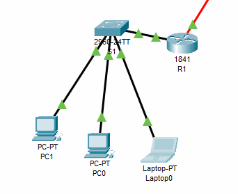

# Packet Tracer Align To Grid

Cisco Packet Tracer is a great tool for learning about networking (and more).

One shortcoming with it is that when you place/move devices in the logical workspace, they are very difficult to align and so your network topologies look unprofessional.

Packet Tracer has an option called *Align logical workspace objects* which attempts to offer some alignment as you move devices. The problem is, it doesn't work properly and often makes things worse.

Introducing **Packet Tracer Align To Grid**!

## Installation

1. Download [AlignToGrid.pts](AlignToGrid.pts)

2. In Packet Tracer, click **Exensions** > **Scripting** > **Configure PT Script Modules**

3. Click the **Add...** button and locate **AlignToGrid.pts**

## Use

Once installed, you can align your items to grid at any time by clicking **Extensions** > **Align devices to grid**

## Notes

Currently it only aligns devices to grid (not notes).
